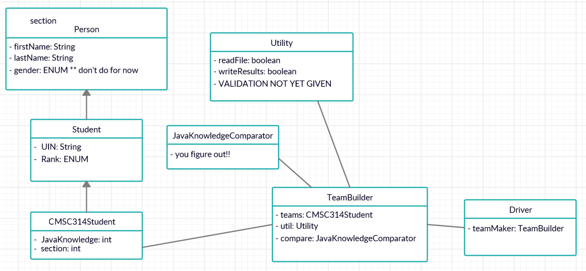

# CSCE_314-Groups_Creator
### Creates pairs of students based on responses from a survey.

### Code Setup:

### Project assumptions:
1.	Names (first and last) will always be separated by a space
2.	The UIN is denoted by the first part of their email.  87123AA3@tamu.edu so 87123AA3 is their UIN
3.	In the results, there likely will be someone by themselves. They become a “sub” for anyone sick.
4.	CREATE THE CODE FROM SCRATCH. You are not to use other “pre-packaged” code other than what Java gives you naturally (all imports shown in notes)
5.	The overall layout of the file will always remain the same
6.	Person (class/file) must be abstract.
7.	Student (class/file) must inherit from Person.
8.	314Student (class/file) must inherit from Student.
9.	JavaKnowledgeComparator (class/file) must be simple and just be used as a comparator with not much utility other than sorting order.
10.	Any Java Collection data structure can be used.
11.	TeamBuilder (class/file) should be where most of the application work is conducted. It will pull from all the other classes EXCEPT Driver.
12.	Driver should be minimum. Probably less than 20 lines.
13.	ENUM for RANK will be “Freshman”, “Sophomore”, “Junior”, “Senior”. But from the data file, Freshman == 1, Sophomore == 2, Junior == 3, Senior == 4.
14.	Any errors caught…will be logged in ErrorLog.txt - the error description must state where (file/class) the error was caught and why
15.	Results of grouping should be placed in results.txt in this form:

    502 - Bowen Lupoli (4) Jamila Booth (2)
